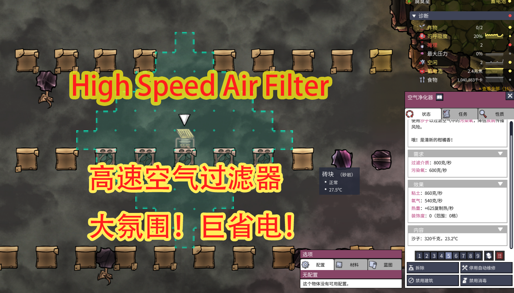
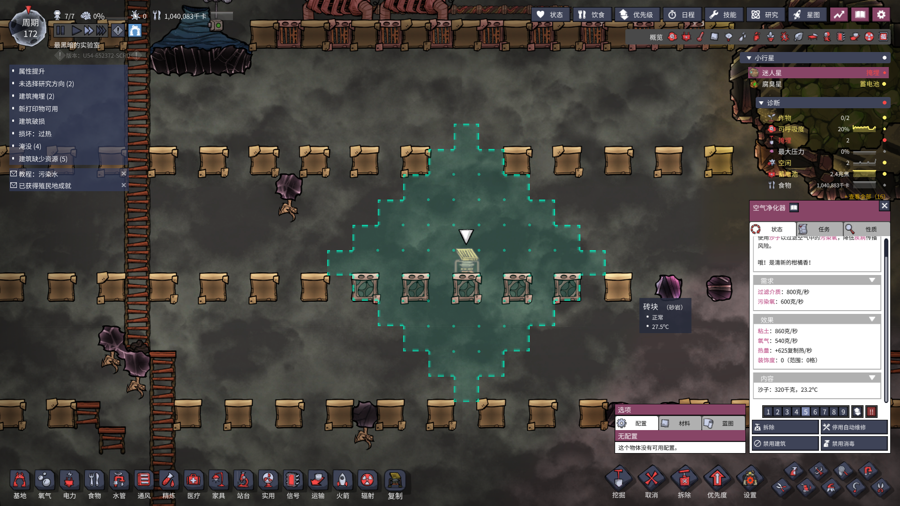
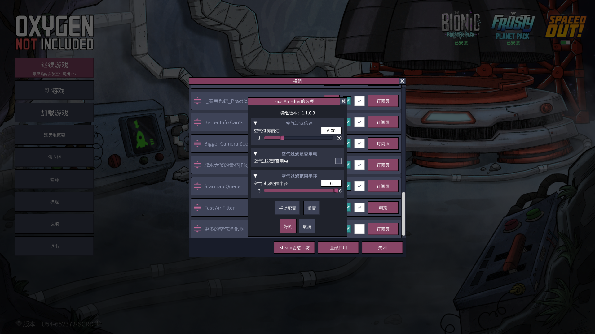

# 高速空气净化器

高速空气净化器是《缺氧》游戏的一个模组，旨在显著提升游戏中空气净化器的性能。通过此模组，玩家可以自定义以下选项，以满足基地的需求：

- **过滤速度倍数**：将空气净化器的过滤速度调整为正常速度的 1 至 20 倍，加速空气净化。
- **过滤范围**：将有效净化范围设置为 3 至 6 格，扩大净化覆盖面积。
- **电力使用选项**：选择空气净化器是否无需电力运行，提供更大的灵活性和节能优势。

通过这些功能，玩家可以有效改善空气质量，扩大净化覆盖范围，并确保即使在电力短缺期间也能持续运行，从而为基地创造更舒适和可持续的环境。

## 安装

1. 确保已安装《缺氧》游戏。
2. 订阅此模组：[https://steamcommunity.com/sharedfiles/filedetails/?id=3423434329](https://steamcommunity.com/sharedfiles/filedetails/?id=3423434329)
3. 启动游戏并在模组菜单中启用“高速空气净化器”模组。

## 使用说明

1. 在游戏中建造空气净化器。
2. 点击空气净化器，进入其设置界面。
3. 根据需求调整以下选项：
   - **过滤速度倍数**：选择 1 至 20 之间的值。
   - **过滤范围**：选择 3 至 6 格的范围。
   - **是否使用电力**：启用或禁用电力需求。

## 开发信息

- **开发环境**：Visual Studio 2022
- **依赖库**：
  - 0Harmony.dll
  - PLib.dll

在开发此模组时，使用了 0Harmony 和 PLib 库，以实现对游戏功能的增强和自定义。

## 许可证

此项目采用 MIT 许可证。有关详细信息，请参阅 LICENSE 文件。

## 致谢

特别感谢 0Harmony 和 PLib 的开发者提供的支持，以及《缺氧》社区的持续支持和反馈。
